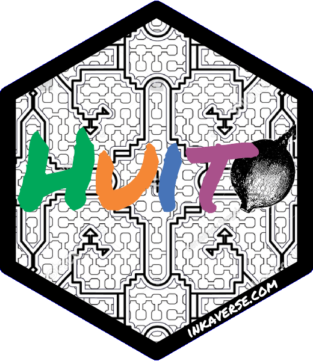

```{r, echo = FALSE, message = FALSE}
knitr::opts_chunk$set(
  fig.align = 'center'
  , collapse = TRUE
  , comment = "#>"
  )
```

# huito 

<!-- badges: start -->
[](https://CRAN.R-project.org/package=huito)
[](https://github.com/Flavjack/huito/actions)
[](https://r-pkg.org/pkg/huito)
<!-- badges: end -->

'Huito' is an open-source R package to deploys reproducible and flexible labels using layers. The 'huito' package is part of the 'inkaverse' project for developing different procedures and tools used in plant science and experimental designs. Learn more about the 'inkaverse' project at <https://inkaverse.com/>.

## Installation

You can install the released version of huito from [CRAN](https://cran.r-project.org/package=huito) with:

``` r
install.packages("huito")
```

And the development version from [GitHub](https://github.com/flavjack/huito) with:

``` r
if (!require("remotes"))
  install.packages("remotes")
remotes::install_github("Flavjack/huito")
```
