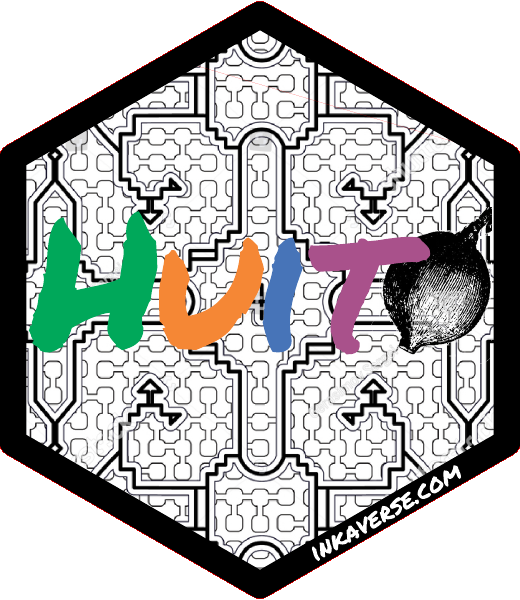

---
format:
  gfm:
    output-file: README.md
editor: source
---

```{r}
#| include: false

knitr::opts_chunk$set(
  fig.align = "center",
  collapse = TRUE,
  comment = "#>"
)
```

# huito 

[](https://CRAN.R-project.org/package=huito)
[](https://zenodo.org/badge/latestdoi/423796397)
[](https://github.com/Flavjack/huito/actions)
[](https://r-pkg.org/pkg/huito)

The **huito** package is an open-source R package designed to deploy reproducible and flexible labels using layers. It is part of the **inkaverse** project, which develops procedures and tools for plant science and experimental designs.

More information about the **inkaverse** project is available at <https://inkaverse.com/>.

## Installation

The stable version of **huito** can be installed from CRAN:

```{r}
#| eval: false

install.packages("huito")
```

To install the latest development version directly from GitHub, it is recommended to use **pak**:

```{r}
#| eval: false

if (!requireNamespace("pak", quietly = TRUE)) {
  install.packages("pak")
}

pak::pkg_install("Flavjack/huito")
```

After installation, load the package:

```{r}
#| eval: false

library(huito)
```
