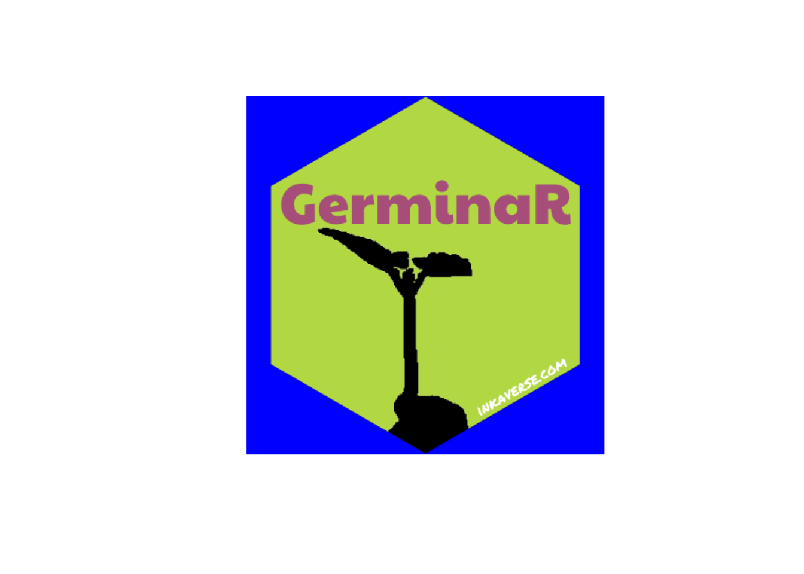

# GerminaR

More information from GerminaR project:
<https://germinar.inkaverse.com/>

## Sticker design

In the layer `include_image(opts = "magick package")` you can add
different arguments and combine them using asterisk (`*`) or
`list("magick function")`.

Options available in [magick
package](https://CRAN.R-project.org/package=magick)

> Select different panel color for your sticker
> (i.e. `include_shape(panel_color = "color")`).

## Package setup

\
[`library`](https://rdrr.io/r/base/library.html)`(`[`huito`](https://huito.inkaverse.com/)`)`\
\
`font`` ``<-`` `[`c`](https://rdrr.io/r/base/c.html)`(``"Paytone One"``, ``"Permanent Marker"``)`\
[`huito_fonts`](http://huito.inkaverse.com/reference/huito_fonts.md)`(``font``)`

## Sticker design

\
`label`` ``<-`` `[`label_layout`](http://huito.inkaverse.com/reference/label_layout.md)`(``size ``=`` `[`c`](https://rdrr.io/r/base/c.html)`(``5.08``, ``5.08``)`\
`                      , border_width ``=`` ``0`\
`                      , background ``=`` ``"#b1d842"`\
`                      ``)`` `[`%>%`](https://magrittr.tidyverse.org/reference/pipe.html)` `\
`  `[`include_image`](http://huito.inkaverse.com/reference/include_image.md)`(``value ``=`` ``"https://germinar.inkaverse.com/img/seed_germination.png"`\
`                , size ``=`` `[`c`](https://rdrr.io/r/base/c.html)`(``5.5``, ``5.5``)`\
`                , position ``=`` `[`c`](https://rdrr.io/r/base/c.html)`(``2.55``, ``1.26``)`\
`                , opts ``=`` `[`list`](https://rdrr.io/r/base/list.html)`(``'image_transparent("white")'`\
`                              , ``'image_modulate(brightness = 0)'``)`\
`                ``)`` `[`%>%`](https://magrittr.tidyverse.org/reference/pipe.html)\
`  `[`include_shape`](http://huito.inkaverse.com/reference/include_shape.md)`(``size ``=`` ``5.08`\
`                , border_width ``=`` ``0`\
`                , position ``=`` `[`c`](https://rdrr.io/r/base/c.html)`(``2.54``, ``2.54``)`\
`                , panel_color ``=`` ``"blue"`\
`                ``)`` `[`%>%`](https://magrittr.tidyverse.org/reference/pipe.html)\
`  `[`include_text`](http://huito.inkaverse.com/reference/include_text.md)`(``value ``=`` ``"GerminaR"`\
`               , font ``=`` ``font``[``1``]`\
`               , size ``=`` ``23`\
`               , position ``=`` `[`c`](https://rdrr.io/r/base/c.html)`(``2.54``, ``3.55``)`\
`               , color ``=`` ``"#a64d79"`\
`               ``)`` `[`%>%`](https://magrittr.tidyverse.org/reference/pipe.html)\
`  `[`include_text`](http://huito.inkaverse.com/reference/include_text.md)`(``value ``=`` ``"inkaverse.com"`\
`               , font ``=`` ``font``[``2``]`\
`               , size ``=`` ``6`\
`               , position ``=`` `[`c`](https://rdrr.io/r/base/c.html)`(``3.9``, ``0.96``)`\
`               , angle ``=`` ``30`\
`               , color ``=`` ``"white"`\
`               ``)`

### Preview mode

\
`label`` `[`%>%`](https://magrittr.tidyverse.org/reference/pipe.html)` `\
`  `[`label_print`](http://huito.inkaverse.com/reference/label_print.md)`(``mode ``=`` ``"preview"``)`

### Complete mode

The final file is exported in `pdf` format.

\
`sticker`` ``<-`` ``label`` `[`%>%`](https://magrittr.tidyverse.org/reference/pipe.html)\
`  `[`label_print`](http://huito.inkaverse.com/reference/label_print.md)`(``filename ``=`` ``"GerminaR"`\
`              , margin ``=`` ``0`\
`              , paper ``=`` `[`c`](https://rdrr.io/r/base/c.html)`(``5.5``, ``5.5``)`\
`              , mode ``=`` ``"complete"`\
`              ``)`

## Transparent logo

Import the image in pdf format and cut the border and make the
`panel_color` transparent.

\
`sticker`` `[`%>%`](https://magrittr.tidyverse.org/reference/pipe.html)` `\
`  `[`image_read_pdf`](https://docs.ropensci.org/magick/reference/editing.html)`(``)``  `[`%>%`](https://magrittr.tidyverse.org/reference/pipe.html)` `\
`  `[`image_crop`](https://docs.ropensci.org/magick/reference/transform.html)`(``geometry ``=`` ``"600x600+40"``)`` `[`%>%`](https://magrittr.tidyverse.org/reference/pipe.html)\
`  `[`image_crop`](https://docs.ropensci.org/magick/reference/transform.html)`(``geometry ``=`` ``"560x600-40"``)`` `[`%>%`](https://magrittr.tidyverse.org/reference/pipe.html)\
`  `[`image_transparent`](https://docs.ropensci.org/magick/reference/color.html)`(``'blue'``)`` `[`%>%`](https://magrittr.tidyverse.org/reference/pipe.html)` `\
`  `[`image_write`](https://docs.ropensci.org/magick/reference/editing.html)`(``"GerminaR.png"``)`

### Final sticker result

\
`include_graphics``(``"GerminaR.png"``)`

