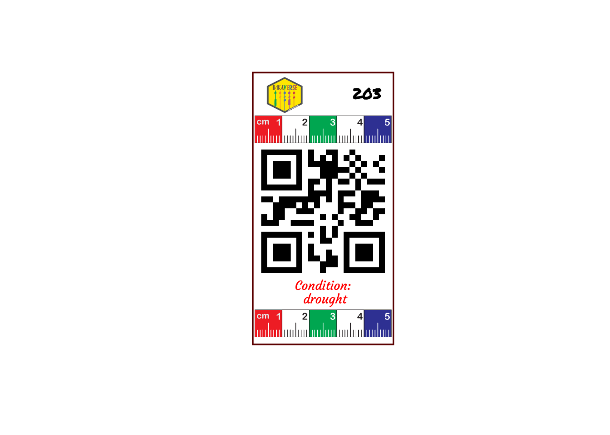

# Field Labels

## Create the experimental fieldbook

The field-book experimental design was deployed with `inti` package
<https://inkaverse.com/articles/apps.html>

``` r

library(inti)

treats <- data.frame(condition = c("irrigated", "drought")
                     , genotypes = c("choclito", "salcedo", "pandela", "puno"))

fb <- tarpuy_design(data = treats
                    , nfactors = 2
                    , type = "rcbd"
                    , rep = 3
                    ) 

fb %>% web_table()
```

## Customize the label layout

The label layout can be customized by combining text, images and QR
codes. Each layer can use values from the experimental fieldbook,
allowing automatic generation of labels for every experimental plot. \>
You can find more fonts in <https://fonts.google.com/>

``` r

library(huito)

font <- c("Permanent Marker", "Tillana", "Courgette")

huito_fonts(font)

label <- fb %>% 
  mutate(color = case_when(
    condition %in% "irrigated" ~ "blue"
    , condition %in% "drought" ~ "red"
  )) %>%
  label_layout(size = c(5.2, 10)
               , border_color = "#5C0000"
               , border_width = 1.5
  ) %>%
  include_image(
    value = "https://inkaverse.com/img/inkaverse.png"
    , size = c(1.3, 1.3)
    , position = c(1.2, 9.15)
  ) %>% 
  include_image(
    value = "https://huito.inkaverse.com/img/scale.pdf"
    , size = c(5, 1)
    , position = c(2.6, 0.8)
  ) %>%
  include_barcode(
    value = "qrcode"
    , size = c(5, 5)
    , position = c(2.6, 4.9)
  ) %>% 
  include_text(value = "plots"
               , position = c(4.2, 9.2)
               , size = 16
               , color = "black"
               , fontface = "bold"
               , font = font[1]
  )  %>% 
  include_image(
    value = "https://huito.inkaverse.com/img/scale.pdf"
    , size = c(5, 1)
    , position = c(2.6, 7.9)
  ) %>% 
  include_text(value = "condition"
               , position = c(2.6, 1.95)
               , size = 13
               , prefix = "Condition:\n "
               , color = "color"
               , fontface = "bold"
               , font = font[3]
  )  
```

You should comment
[`huito_fonts()`](http://huito.inkaverse.com/reference/huito_fonts.md)
after the first running as we already imported the fonts.

### Preview the label

The preview mode `label_print(mode = "preview")` generate a example of
the label design from a random row of the data set.

``` r

label %>% 
  label_print(mode = "preview")
```



### Generate the complete label set

If you want generate the complete labels list, change:
`label_print(mode = "complete")`.

``` r

label %>% 
  label_print(mode = "complete", filename = "etiquetas_campo", nlabels = 10, dpi= 1200, rasterize= T)
```
