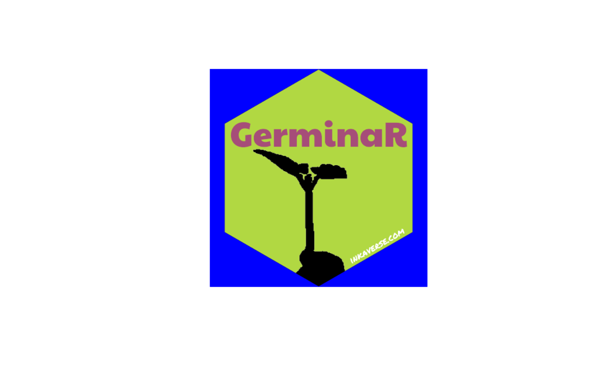
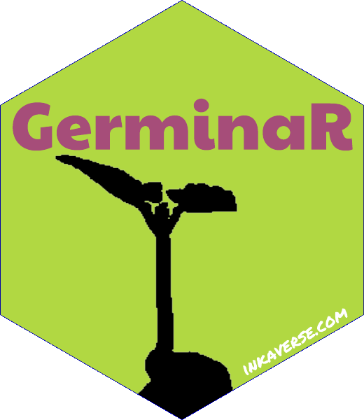

# GerminaR

More information from GerminaR project:
<https://germinar.inkaverse.com/>

## Sticker design

In the layer `include_image(opts = "magick package")` you can add
different arguments and combine them using asterisk (`*`) or
`list("magick function")`.

Options available in [magick
package](https://CRAN.R-project.org/package=magick)

> Select different panel color for your sticker
> (i.e. `include_shape(panel_color = "color")`).

``` r

library(huito)

font <- c("Paytone One", "Permanent Marker")

huito_fonts(font)

label <- label_layout(size = c(5.08, 5.08)
                      , border_width = 0
                      , background = "#b1d842"
                      ) %>% 
  include_image(value = "https://germinar.inkaverse.com/img/seed_germination.png"
                , size = c(5.5, 5.5)
                , position = c(2.55, 1.26)
                , opts = list('image_transparent("white")'
                              , 'image_modulate(brightness = 0)')
                ) %>%
  include_shape(size = 5.08
                , border_width = 0
                , position = c(2.54, 2.54)
                , panel_color = "blue"
                ) %>%
  include_text(value = "GerminaR"
               , font = font[1]
               , size = 23
               , position = c(2.54, 3.55)
               , color = "#a64d79"
               ) %>%
  include_text(value = "inkaverse.com"
               , font = font[2]
               , size = 6
               , position = c(3.9, 0.96)
               , angle = 30
               , color = "white"
               )
```

### Preview mode

``` r

label %>% 
  label_print(mode = "preview")
```



### Complete mode

The final file is exported in `pdf` format.

``` r

sticker <- label %>%
  label_print(filename = "GerminaR"
              , margin = 0
              , paper = c(5.5, 5.5)
              , mode = "complete"
              )
```

## Transparent logo

Import the image in pdf format and cut the border and make the
`panel_color` transparent.

``` r

sticker %>% 
  image_read_pdf()  %>% 
  image_crop(geometry = "600x600+40") %>%
  image_crop(geometry = "560x600-40") %>%
  image_transparent('blue') %>% 
  image_write("GerminaR.png")
```

### Final sticker result


