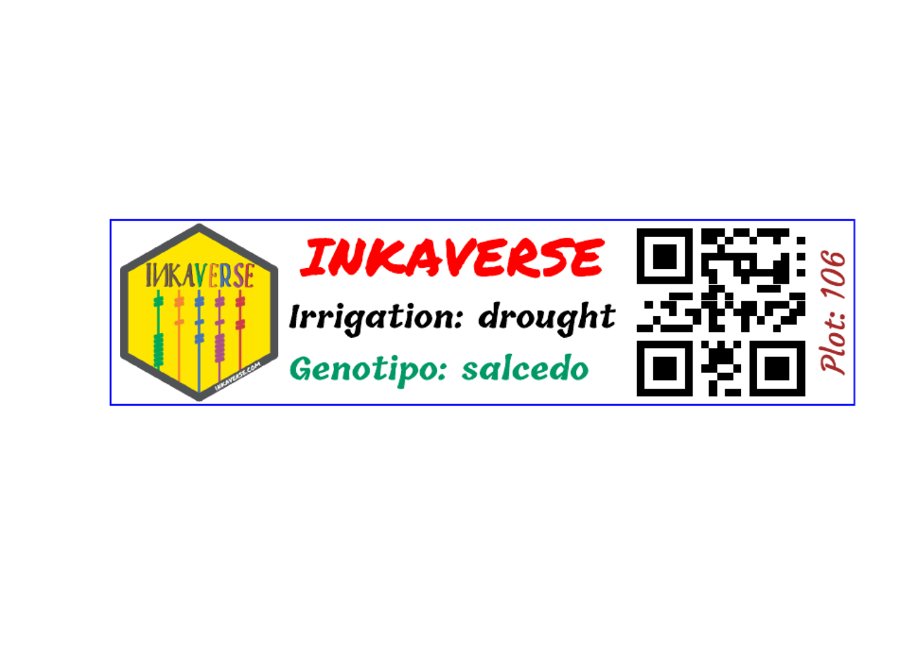

# horizontal

## Create the experimental field book

The field book experimental design was deployed with `inti` package
<https://inkaverse.com/articles/apps.html>

\
[`library`](https://rdrr.io/r/base/library.html)`(`[`inti`](https://inkaverse.com/)`)`\
\
`treats`` ``<-`` `[`data.frame`](https://rdrr.io/r/base/data.frame.html)`(``condition ``=`` `[`c`](https://rdrr.io/r/base/c.html)`(``"irrigated"``, ``"drought"``)`\
`                     , genotypes ``=`` `[`c`](https://rdrr.io/r/base/c.html)`(``"choclito"``, ``"salcedo"``, ``"pandela"``, ``"puno"``)``)`\
\
`fb`` ``<-`` `[`tarpuy_design`](https://inkaverse.com/reference/tarpuy_design.html)`(``data ``=`` ``treats`\
`                    , nfactors ``=`` ``2`\
`                    , type ``=`` ``"rcbd"`\
`                    , rep ``=`` ``3`\
`                    , project ``=`` ``"inkaverse"`\
`                    ``)`` `\
\
`fb`` `[`%>%`](https://magrittr.tidyverse.org/reference/pipe.html)` `[`web_table`](https://inkaverse.com/reference/web_table.html)`(``)`

## Customize the label layout

The label layout can be customized by combining text, images and QR
codes. Each layer can use values from the experimental field book,
allowing automatic generation of labels for every experimental plot.

Load package and import fonts.

\
[`library`](https://rdrr.io/r/base/library.html)`(`[`huito`](https://huito.inkaverse.com/)`)`\
\
`font`` ``<-`` `[`c`](https://rdrr.io/r/base/c.html)`(``"Permanent Marker"``, ``"Tillana"``, ``"Courgette"``)`\
\
[`huito_fonts`](http://huito.inkaverse.com/reference/huito_fonts.md)`(``font``)`

> You can find more fonts in <https://fonts.google.com/>

## Label design

\
`label`` ``<-`` ``fb`` `[`%>%`](https://magrittr.tidyverse.org/reference/pipe.html)`  `\
`  `[`label_layout`](http://huito.inkaverse.com/reference/label_layout.md)`(``size ``=`` `[`c`](https://rdrr.io/r/base/c.html)`(``10``, ``2.5``)`\
`               , border_color ``=`` ``"blue"`\
`               ``)`` `[`%>%`](https://magrittr.tidyverse.org/reference/pipe.html)\
`  `[`include_image`](http://huito.inkaverse.com/reference/include_image.md)`(`\
`    value ``=`` ``"https://flavjack.github.io/inti/img/inkaverse.png"`\
`    , size ``=`` `[`c`](https://rdrr.io/r/base/c.html)`(``2.1``, ``2.4``)`\
`    , position ``=`` `[`c`](https://rdrr.io/r/base/c.html)`(``1.2``, ``1.25``)`\
`    ``# , opts = list("image_scale(200)", "image_noise()")`\
`    ``)`` `[`%>%`](https://magrittr.tidyverse.org/reference/pipe.html)\
`  `[`include_barcode`](http://huito.inkaverse.com/reference/include_barcode.md)`(`\
`     value ``=`` ``"barcode"`\
`     , size ``=`` `[`c`](https://rdrr.io/r/base/c.html)`(``2.5``, ``2.5``)`\
`     , position ``=`` `[`c`](https://rdrr.io/r/base/c.html)`(``8.2``, ``1.25``)`\
`     ``)`` `[`%>%`](https://magrittr.tidyverse.org/reference/pipe.html)\
`  `[`include_text`](http://huito.inkaverse.com/reference/include_text.md)`(``value ``=`` ``"INKAVERSE"`\
`               , position ``=`` `[`c`](https://rdrr.io/r/base/c.html)`(``4.6``, ``2``)`\
`               , size ``=`` ``20`\
`               , font ``=`` ``font``[``1``]`\
`               , fontface ``=`` ``"bold"`\
`               , color ``=`` ``"red"`\
`               ``)`` `[`%>%`](https://magrittr.tidyverse.org/reference/pipe.html)\
`  `[`include_text`](http://huito.inkaverse.com/reference/include_text.md)`(``value ``=`` ``"condition"`\
`               , position ``=`` `[`c`](https://rdrr.io/r/base/c.html)`(``2.4``, ``1.2``)`\
`               , size ``=`` ``12`\
`               , font ``=`` ``font``[``2``]`\
`               , opts ``=`` `[`list`](https://rdrr.io/r/base/list.html)`(``hjust ``=`` ``0.0``, vjust ``=`` ``0.0``)`` `\
`               , prefix ``=`` ``"Irrigation: "`\
`               , fontface ``=`` ``"bold"`\
`               ``)`` `[`%>%`](https://magrittr.tidyverse.org/reference/pipe.html)\
`  `[`include_text`](http://huito.inkaverse.com/reference/include_text.md)`(``value ``=`` ``"genotypes"`\
`               , position ``=`` `[`c`](https://rdrr.io/r/base/c.html)`(``2.4``, ``0.5``)`\
`               , size ``=`` ``12`\
`               , color ``=`` ``"#009966"`\
`               , font ``=`` ``font``[``2``]`\
`               , opts ``=`` `[`list`](https://rdrr.io/r/base/list.html)`(``hjust ``=`` ``0.0``, vjust ``=`` ``0.0``)`\
`               , prefix ``=`` ``"Genotipo: "`\
`               , fontface ``=`` ``"bold"`\
`               ``)`` `[`%>%`](https://magrittr.tidyverse.org/reference/pipe.html)` `\
`  `[`include_text`](http://huito.inkaverse.com/reference/include_text.md)`(``value ``=`` ``"plots"`\
`               , position ``=`` `[`c`](https://rdrr.io/r/base/c.html)`(``9.7``, ``1.25``)`\
`               , angle ``=`` ``90`\
`               , size ``=`` ``12`\
`               , color ``=`` ``"brown"`\
`               , font ``=`` ``font``[``3``]`\
`               , prefix ``=`` ``"Plot: "`\
`               ``)`` `

### Preview mode

The preview mode `label_print(mode = "preview")` generate a example of
the label design from a random row of the data set.

\
`label`` `[`%>%`](https://magrittr.tidyverse.org/reference/pipe.html)` `\
`  `[`label_print`](http://huito.inkaverse.com/reference/label_print.md)`(``mode ``=`` ``"preview"``)`

### Complete mode

If you want generate the complete labels list, change:
`label_print(mode = "complete")`.

\
`label`` `[`%>%`](https://magrittr.tidyverse.org/reference/pipe.html)` `\
`  `[`label_print`](http://huito.inkaverse.com/reference/label_print.md)`(``mode ``=`` ``"complete"``, filename ``=`` ``"horizontal"`\
`              , nlabels ``=`` ``10``)`
