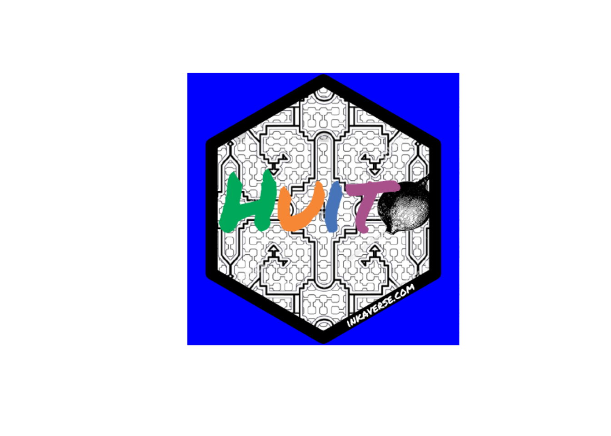
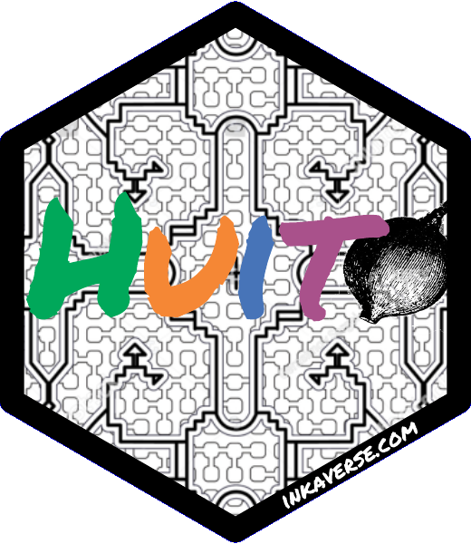

# Huito

Details and examples of more stickers you can find in the following
link: <https://github.com/GuangchuangYu/hexSticker>

## Sticker design

You can design your sticker by layers. You can add each element
individually in the design.

## Package setup

\
[`library`](https://rdrr.io/r/base/library.html)`(`[`huito`](https://huito.inkaverse.com/)`)`\
\
`font`` ``<-`` `[`c`](https://rdrr.io/r/base/c.html)`(``"Permanent Marker"``)`\
[`huito_fonts`](http://huito.inkaverse.com/reference/huito_fonts.md)`(``font``)`

> You can find more fonts in <https://fonts.google.com/>

## Sticker design

\
`label`` ``<-`` `[`label_layout`](http://huito.inkaverse.com/reference/label_layout.md)`(``size ``=`` `[`c`](https://rdrr.io/r/base/c.html)`(``5.08``, ``5.08``)`\
`                      , border_width ``=`` ``0`\
`                      ``)`` `[`%>%`](https://magrittr.tidyverse.org/reference/pipe.html)` `\
`  `[`include_image`](http://huito.inkaverse.com/reference/include_image.md)`(``value ``=`` ``"https://flavjack.github.io/huito/img/shipibo.png"`\
`                , size ``=`` `[`c`](https://rdrr.io/r/base/c.html)`(``7``, ``7``)`\
`                , position ``=`` `[`c`](https://rdrr.io/r/base/c.html)`(``2.55``, ``2.52``)`\
`                , opts ``=`` `[`list`](https://rdrr.io/r/base/list.html)`(``"image_scale(600)"``)`\
`                ``)`` `[`%>%`](https://magrittr.tidyverse.org/reference/pipe.html)\
`  `[`include_text`](http://huito.inkaverse.com/reference/include_text.md)`(``value ``=`` ``"H"`\
`               , size ``=`` ``45`` `\
`               , position ``=`` `[`c`](https://rdrr.io/r/base/c.html)`(``1.15``, ``2.7``)`\
`               , color ``=`` ``"#00a85a"`\
`               , font ``=`` ``font``[``1``]`\
`               ``)`` `[`%>%`](https://magrittr.tidyverse.org/reference/pipe.html)\
`  `[`include_text`](http://huito.inkaverse.com/reference/include_text.md)`(``value ``=`` ``"u"`\
`               , size ``=`` ``45`` `\
`               , position ``=`` `[`c`](https://rdrr.io/r/base/c.html)`(``2.07``, ``2.7``)`\
`               , color ``=`` ``"#f58735"`\
`               , font ``=`` ``font``[``1``]`\
`               ``)`` `[`%>%`](https://magrittr.tidyverse.org/reference/pipe.html)\
`  `[`include_text`](http://huito.inkaverse.com/reference/include_text.md)`(``value ``=`` ``"i"`\
`               , size ``=`` ``45`` `\
`               , position ``=`` `[`c`](https://rdrr.io/r/base/c.html)`(``2.73``, ``2.7``)`\
`               , color ``=`` ``"#4774b8"`\
`               , font ``=`` ``font``[``1``]`\
`               ``)`` `[`%>%`](https://magrittr.tidyverse.org/reference/pipe.html)\
`  `[`include_image`](http://huito.inkaverse.com/reference/include_image.md)`(``value ``=`` ``"https://flavjack.github.io/huito/img/huito_fruit.png"`\
`                , size ``=`` `[`c`](https://rdrr.io/r/base/c.html)`(``1.3``, ``1.3``)`` `\
`                , position ``=`` `[`c`](https://rdrr.io/r/base/c.html)`(``4.06``, ``2.6``)`\
`                ``)`` `[`%>%`](https://magrittr.tidyverse.org/reference/pipe.html)\
`  `[`include_text`](http://huito.inkaverse.com/reference/include_text.md)`(``value ``=`` ``"t"`\
`               , size ``=`` ``45`` `\
`               , position ``=`` `[`c`](https://rdrr.io/r/base/c.html)`(``3.33``, ``2.7``)`\
`               , color ``=`` ``"#a9518b"`\
`               , font ``=`` ``font``[``1``]`\
`               ``)`` `[`%>%`](https://magrittr.tidyverse.org/reference/pipe.html)\
`  `[`include_shape`](http://huito.inkaverse.com/reference/include_shape.md)`(``size ``=`` ``5.08`\
`                , border_width ``=`` ``3`\
`                , border_color ``=`` ``"black"`\
`                , position ``=`` `[`c`](https://rdrr.io/r/base/c.html)`(``2.54``, ``2.54``)`\
`                , panel_color ``=`` ``"blue"`\
`                ``)`` `[`%>%`](https://magrittr.tidyverse.org/reference/pipe.html)\
`  `[`include_text`](http://huito.inkaverse.com/reference/include_text.md)`(``value ``=`` ``"inkaverse.com"`\
`               , size ``=`` ``6`\
`               , position ``=`` `[`c`](https://rdrr.io/r/base/c.html)`(``3.6``, ``0.75``)`\
`               , angle ``=`` ``30`\
`               , color ``=`` ``"white"`\
`               , font ``=`` ``font`\
`               ``)`` `

> Select different panel color for your sticker
> (i.e. `include_shape(panel_color = "color")`).

### Preview mode

\
`label`` `[`%>%`](https://magrittr.tidyverse.org/reference/pipe.html)` `\
`  `[`label_print`](http://huito.inkaverse.com/reference/label_print.md)`(``mode ``=`` ``"preview"``)`

### Complete mode

The final file is exported in `pdf` format.

\
`sticker`` ``<-`` ``label`` `[`%>%`](https://magrittr.tidyverse.org/reference/pipe.html)` `\
`  `[`label_print`](http://huito.inkaverse.com/reference/label_print.md)`(``filename ``=`` ``"huito"`\
`              , margin ``=`` ``0`\
`              , paper ``=`` `[`c`](https://rdrr.io/r/base/c.html)`(``5.5``, ``5.5``)`\
`              , mode ``=`` ``"complete"`\
`              ``)`

## Transparent logo

Import the image in pdf and cut the border and make the `panel_color`
transparent.

\
`sticker`` `[`%>%`](https://magrittr.tidyverse.org/reference/pipe.html)` `\
`  `[`image_read_pdf`](https://docs.ropensci.org/magick/reference/editing.html)`(``)``  `[`%>%`](https://magrittr.tidyverse.org/reference/pipe.html)` `\
`  `[`image_transparent`](https://docs.ropensci.org/magick/reference/color.html)`(``"blue"``)`` `[`%>%`](https://magrittr.tidyverse.org/reference/pipe.html)` `\
`  `[`image_crop`](https://docs.ropensci.org/magick/reference/transform.html)`(``geometry ``=`` ``"600x600+40"``)`` `[`%>%`](https://magrittr.tidyverse.org/reference/pipe.html)\
`  `[`image_crop`](https://docs.ropensci.org/magick/reference/transform.html)`(``geometry ``=`` ``"560x600-40"``)`` `[`%>%`](https://magrittr.tidyverse.org/reference/pipe.html)\
`  `\
`  `[`image_write`](https://docs.ropensci.org/magick/reference/editing.html)`(``"huito.png"``)`

### Final sticker result

\
`include_graphics``(``"huito.png"``)`

