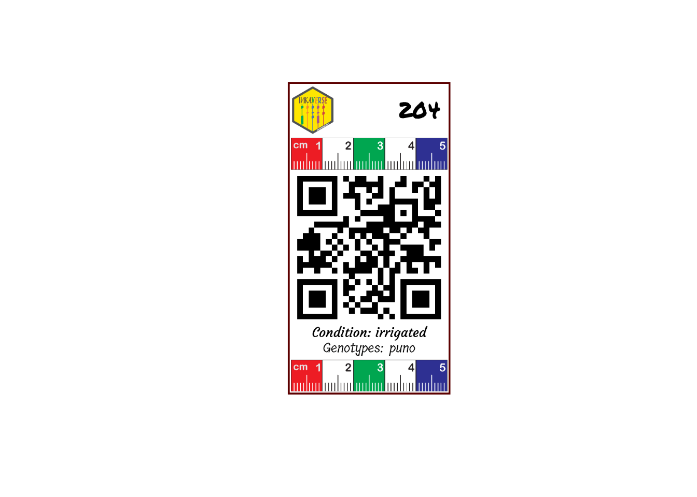

# vertical

## Create the experimental field book

The field book experimental design was deployed with `inti` package
<https://inkaverse.com/articles/apps.html>

``` r

library(inti)

treats <- data.frame(condition = c("irrigated", "drought")
                     , genotypes = c("choclito", "salcedo", "pandela", "puno"))

fb <- tarpuy_design(data = treats
                    , nfactors = 2
                    , type = "rcbd"
                    , rep = 3
                    , project = "inkaverse"
                    ) 

fb %>% web_table()
```

## Customize the label layout

The label layout can be customized by combining text, images and QR
codes. Each layer can use values from the experimental field book,
allowing automatic generation of labels for every experimental plot.

Load package and import fonts.

``` r

library(huito)

font <- c("Permanent Marker", "Tillana", "Courgette")

huito_fonts(font)
```

> You can find more fonts in <https://fonts.google.com/>

## Label design

``` r

label <- fb %>%
  label_layout(
    size = c(5.2, 10)
    ,
    border_color = "#5C0000"
    ,
    border_width = 1.5
  ) %>%
  include_image(
    value = "https://inkaverse.com/img/inkaverse.png"
    ,
    size = c(1.3, 1.5)
    ,
    position = c(0.8, 9.1)
  )  %>%
  include_text(
    value = "plots"
    ,
    position = c(4.2, 9.1)
    ,
    size = 20
    ,
    color = "black"
    ,
    fontface = "bold"
    ,
    font = font[1]
  )  %>%
  include_image(value = "https://huito.inkaverse.com/img/scale.pdf"
                ,
                size = c(5, 1)
                ,
                position = c(2.6, 7.7)) %>%
  include_barcode(value = "qrcode"
                  ,
                  size = c(5, 5)
                  ,
                  position = c(2.6, 4.7)) %>%
  include_text(
    value = "condition"
    ,
    position = c(2.6, 2)
    ,
    size = 12
    ,
    prefix = "Condition: "
    ,
    font = font[3]
  )  %>%
  include_text(
    value = "genotypes"
    ,
    position = c(2.6, 1.5)
    ,
    size = 12
    ,
    prefix = "Genotypes: "
    ,
    font = font[2]
  )  %>%
  include_image(value = "https://huito.inkaverse.com/img/scale.pdf"
                ,
                size = c(5, 1)
                ,
                position = c(2.6, 0.6)) 
```

### Label preview

The preview mode `label_print(mode = "preview")` generate a example of
the label design from a random row of the data set.

``` r

label %>% 
  label_print(mode = "preview")
```



### Generate the complete labels

If you want generate the complete labels list, change:
`label_print(mode = "complete")`.

``` r

label %>% 
  label_print(mode = "complete"
              , filename = "vertical"
              , nlabels = 12)
```
