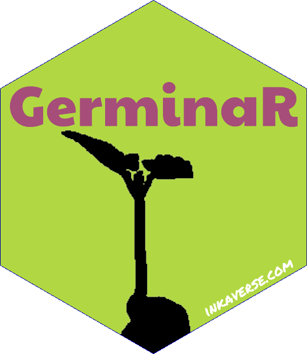

```{r setup, include = FALSE}
source("https://raw.githubusercontent.com/Flavjack/inti/master/pkgdown/favicon/docs.r")
```

More information from GerminaR project: <https://germinar.inkaverse.com/>

```{r echo = TRUE, eval = T}
library(huito)

huito_fonts(c("Paytone One"))

label <- label_layout(size = c(5.08, 5.08)
                      , border_color = NA
                      , border_width = 0
                      , background = "#b1d842"
                      ) %>% 
  include_image(value = "https://germinar.inkaverse.com/img/seed_germination.png"
                , size = c(5.5, 5.5)
                , position = c(2.55, 1.3)
                , opts = 'image_transparent("white")*image_modulate(brightness = 0)'
                ) %>%
  include_shape(size = 4.2
                , border_width = 3
                , border_color = NA
                , margin = -0.8
                , position = c(2.54, 2.54)
                , panel_color = "blue"
                , panel_size = 5.08
                ) %>%
  include_text(value = "GerminaR"
               , font = "Paytone One"
               , size = 23
               , position = c(2.54, 3.56)
               , color = "#a64d79"
               ) %>%
  include_text(value = "inkaverse.com"
               , size = 6
               , position = c(3.9, 0.96)
               , angle = 30
               , color = "white"
               )
```

You can add more image option via `magick` R package functions `include_image(opts)` <https://CRAN.R-project.org/package=magick>. 

Select at `panel_color()` different from the colors in your stickers background. 

## Preview mode

```{r, echo = TRUE}
label %>% 
  label_print(mode = "preview", smpres = 300, viewer = F)
```

## Complete mode

```{r, echo = TRUE}
sticker <- label %>% 
  label_print(filename = "GerminaR"
              , margin = 0
              , paper = c(5.5, 5.5)
              , viewer = T
              , smpres = 300
              , mode = "complete"
              )
```

```{r out.width = "40%", eval = T}
sticker %>% 
  image_read_pdf(density = 300) 
```

# Transparent logo

Import the image in pdf format and cut the border and make the `panel_color` transparent.

```{r, echo = TRUE}
sticker %>% 
  image_read_pdf()  %>% 
  image_crop(geometry = "600x600+40") %>%
  image_crop(geometry = "560x600-40") %>%
  image_transparent('blue') %>% 
  image_write("GerminaR.png")
```

## Final sticker result

```{r out.width = "35%"}

```

