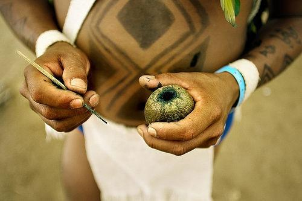

El **huito (*Genipa americana*)** is a species of trees in the family Rubiaceae. It is a species native from the tropical forests of North and South America.

El paquete lleva este nombre ya que el ***huito** *por sus propiedades de colorante es usado por los nativos de la amazonia para teñir y pintarse el cuerpo.

{#fig:id.bl2tuxtg6f7n}

El paquete permite hacer diseño de etiquetas de diferentes formas y tamaños. El fundamento de ***huito** *es el uso de capas para realizar el diseño de los modelos de etiquetas.

