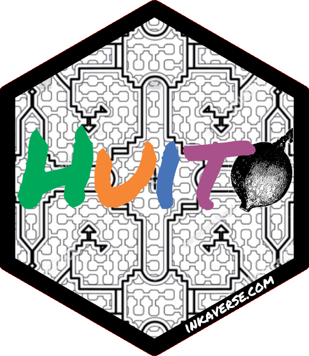

```{r setup, include = FALSE}
source("https://raw.githubusercontent.com/Flavjack/inti/master/pkgdown/favicon/docs.r")
```

More information and examples for a sticker you can find in the following link: http://hexb.in/

```{r echo = TRUE, eval = T}
library(huito)

huito_fonts()

label <- label_layout(size = c(5.08, 5.08)
                      , border_color = NA
                      , border_width = 0
                      ) %>% 
  include_image(value = "https://flavjack.github.io/huito/img/shipibo.png"
                , size = c(7, 7)
                , position = c(2.55, 2.52)
                ) %>%
  include_text(value = "H", size = 45 , position = c(1.15, 2.7), color = "#00a85a") %>%
  include_text(value = "u", size = 45 , position = c(2.07, 2.7), color = "#f58735") %>%
  include_text(value = "i", size = 45 , position = c(2.73, 2.7), color = "#4774b8") %>%
  include_image(value = "https://flavjack.github.io/huito/img/huito_fruit.png"
                , size = c(1.3, 1.3) 
                , position = c(4.06, 2.6)
                ) %>%
  include_text(value = "t", size = 45 , position = c(3.33, 2.7), color = "#a9518b") %>%
  include_shape(size = 4.1
                , border_width = 3
                , border_color = "black"
                , margin = -0.8
                , position = c(2.54, 2.54)
                , panel_color = "red"
                , panel_size = 5.08
                ) %>%
  include_text(value = "inkaverse.com"
               , size = 6
               , position = c(3.6, 0.75)
               , angle = 30
               , color = "white") 
```

Select at `panel_color()` different from the colors in your stickers background. 

## Preview mode

```{r, echo = TRUE}
label %>% 
  label_print(mode = "sample", smpres = 300, viewer = F)
```

## Complete mode

```{r, echo = TRUE}
sticker <-   label %>% 
  label_print(filename = "huito"
              , margin = 0
              , paper = c(5.5, 5.5)
              , viewer = T
              , smpres = 300
              , mode = "complete"
              )
```

```{r out.width = "40%", eval = T}
sticker %>% 
  image_read_pdf(density = 300) 
```

# Transparent logo

Import the image in pdf format and cut the border and make the `panel_color` transparent.

```{r, echo = TRUE}
sticker %>% 
  image_read_pdf()  %>% 
  image_crop(geometry = "600x600+40") %>%
  image_crop(geometry = "560x600-40") %>%
  image_transparent('red') %>% 
  image_write("huito.png")
```

## Final sticker result

```{r out.width = "35%"}

```

