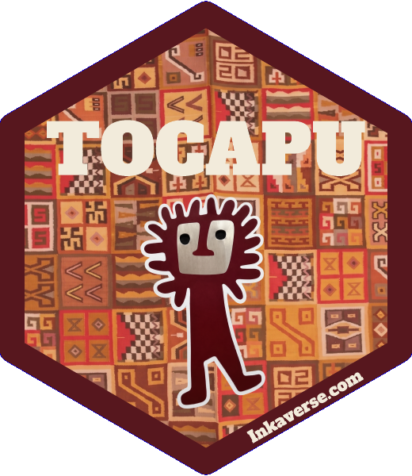
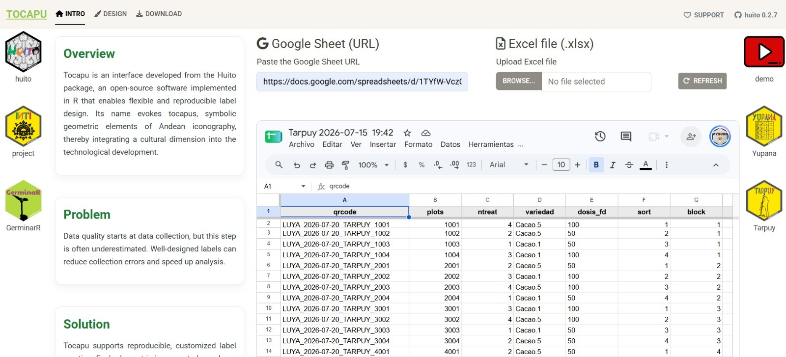
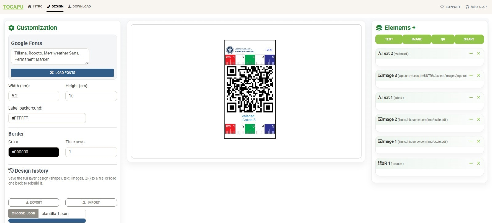
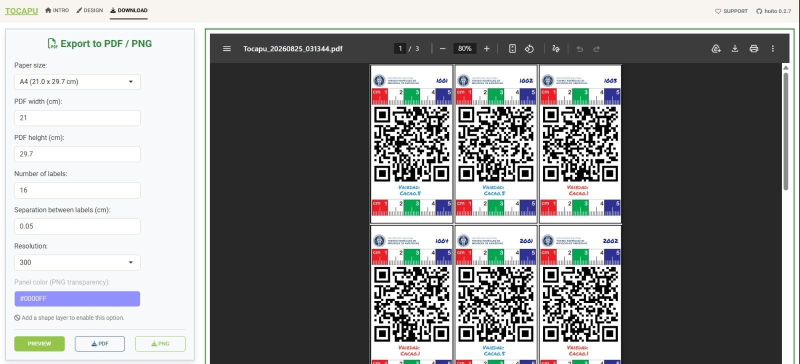
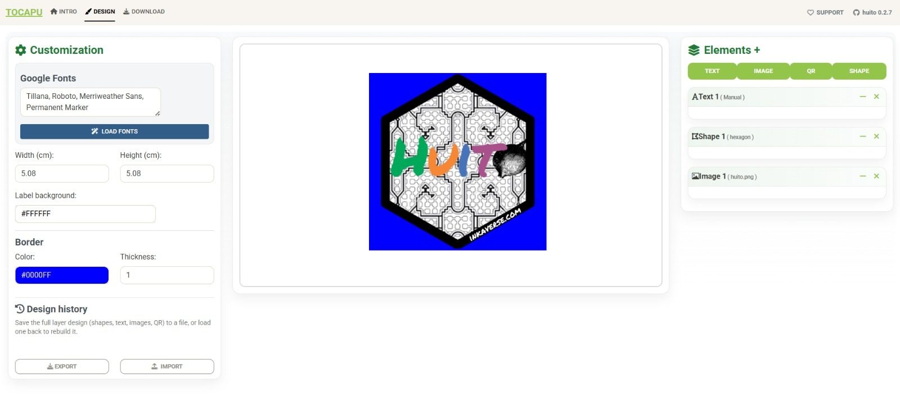
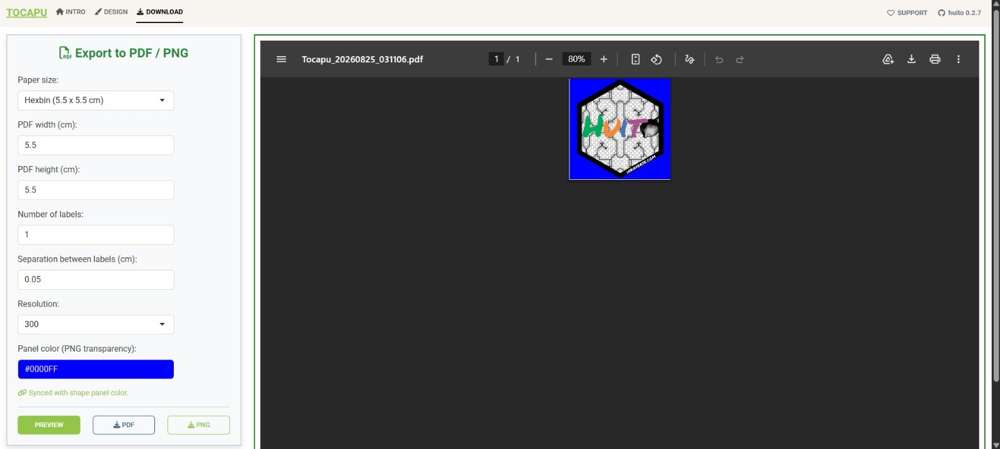

```{r setup, include = FALSE}
source("https://raw.githubusercontent.com/Flavjack/inti/master/pkgdown/favicon/docs.r")
```

**Tocapu for R** is an interface developed from the `huito` package, an open-source R package that enables flexible and reproducible label design. Its name evokes *tocapus*, symbolic geometric elements of Andean iconography, integrating a cultural dimension into the technological development.

Data quality starts at data collection, but this step is often underestimated. Well-designed labels can reduce collection errors and speed up analysis. Tocapu supports reproducible, customized label creation: each element (text, image, QR code or shape) is incorporated as an independent layer, so labels can be **linked to a fieldbook** (one label per row, e.g. for field tags) or **designed freely** as a standalone template (e.g. a logo or sticker), without any data behind it.

```{=html}
<div id=footer style="width:100%; margin:auto;">

<div style="display:inline-block; width:48%">
<p style="text-align:center">
<a target="_blank" href="https://www.youtube.com/playlist?list=PLZVasfsF8pv0"></a> 
<span style="display:block;"><small>Demo</small></span>
</p></div>

<div style="display:inline-block; width:48%">
<p style="text-align:center">
<a target="_blank" href="https://vyxugo.shinyapps.io/tocapu/"></a>
<span style="display:block;"><small>Tocapu</small></span>
</p></div>

</div>
```

# App modules

The application is composed of three tabs. The "Design" tab can be used in two ways, depending on whether the labels are linked to a fieldbook or built as a standalone design.

| Tab | Description |
|---|---|
| **Intro** | Import the fieldbook (Google Sheet URL or Excel file). Only required for data-driven labels. |
| **Design** | Build the label layout with layers (text, image, QR, shape). Two use cases: **data-driven labels** (fields bound to fieldbook columns) or **shapes / sticker design** (freeform, manually written elements). Either way, the design can be saved and reloaded as a `.json` template. |
| **Download** | Preview and export the final labels to PDF or PNG, in any paper size, with the number of copies and spacing you need. |

# Data processing

## Fieldbook

If your labels will be **linked to a database**, go to the "Intro" tab first and load your fieldbook. Tocapu reads it directly from a **Google Sheet URL** or from an uploaded **Excel (.xlsx) file**.

Each row of the sheet becomes one label, and each column (e.g. qrcode, plots, ntreat, variedad, dosis_fd, sort, block) becomes a data field that can be linked to a text or QR element in the "Design" tab. If you only want to build a standalone design (a logo, a sticker), this step is not necessary — you can go directly to "Design".

```{r impdt, echo=FALSE, out.width='100%', fig.cap= "Intro tab: import the fieldbook from a Google Sheet or an Excel file", fig.align='center'}

```

## Label design

The "Design" tab has three panels:

- **Customization** (left): Google Fonts to load, label **width/height** (cm), **background color** and **border** (color and thickness).
- **Canvas** (center): a live preview of the label, showing exactly how it will look once exported.
- **Elements** (right): the layers that make up the label. Four types are available:
  - `TEXT` — a fixed, manually written text, or a field mapped from the fieldbook (e.g. `variedad`, `plots`).
  - `IMAGE` — a logo or picture, either uploaded or linked from a URL.
  - `QR` — a QR code generated from a fieldbook column (e.g. `qrcode`).
  - `SHAPE` — geometric shapes (rectangles, hexagons, etc.) used as backgrounds or decorative panels.

Layers can be reordered, resized and repositioned on the canvas, and each one can be deleted (✕) or hidden. Whether the design ends up being data-driven or a standalone shape/sticker just depends on which layers you add and whether you bind them to a fieldbook column or type them in manually.

### Data-driven labels

When elements are bound to fieldbook columns, one label is generated **per row** of the data. A typical example combines a `QR` layer (bound to `qrcode`), one or two `TEXT` layers (e.g. `plots`, `variedad`) and an institutional `IMAGE` (logo), over a ruler-style background used to size specimens or samples in the field.

```{r design_qr, echo=FALSE, fig.cap='Design tab: data-driven label, with QR, text and logo layers bound to the fieldbook (5.2 x 10 cm)', fig.align='center', out.width='100%'}

```

### Export for labels

For field labels generated from a fieldbook, several copies are usually printed together on a standard sheet. Here 16 QR labels are laid out on an A4 (21 x 29.7 cm) page, each numbered sequentially from the data.

```{r download_a4, echo=FALSE, fig.cap='Download tab: 16 data-driven QR labels exported together on an A4 sheet', fig.align='center', out.width='100%'}

```


### Shapes / sticker design

Because every element is an independent layer, Tocapu can also be used **without any fieldbook**, to build a standalone shape or sticker. In this example a `SHAPE` (hexagon) is used as a background panel, with an `IMAGE` layer and a manually written `TEXT` layer placed on top. This produces a **single** design, not one per row.

```{r design_logo, echo=FALSE, fig.cap='Design tab: standalone shape/sticker design, built from a shape, an image and a manual text layer (5.08 x 5.08 cm)', fig.align='center', out.width='100%'}

```

### Design history

Whichever path you take, the full layer design (shapes, text, images, QR) can be saved as a `.json` template from **Design history**, and reloaded later (`CHOOSE .JSON`) to rebuild the exact same layout - useful for replicating a label across other experiments or trials, or reusing a sticker design, without redoing the layer setup each time.

## Export for forms

For a standalone shape/sticker design, the paper size can be set to match the label exactly - here the predefined "Hexbin" preset (5.5 x 5.5 cm) - and exported as a single PNG, with the shape's fill color used as the transparency panel.

```{r download_hexbin, echo=FALSE, fig.cap='Download tab: single shape/sticker exported at the "Hexbin" preset size (5.5 x 5.5 cm) with synced panel color', fig.align='center', out.width='100%'}

```

